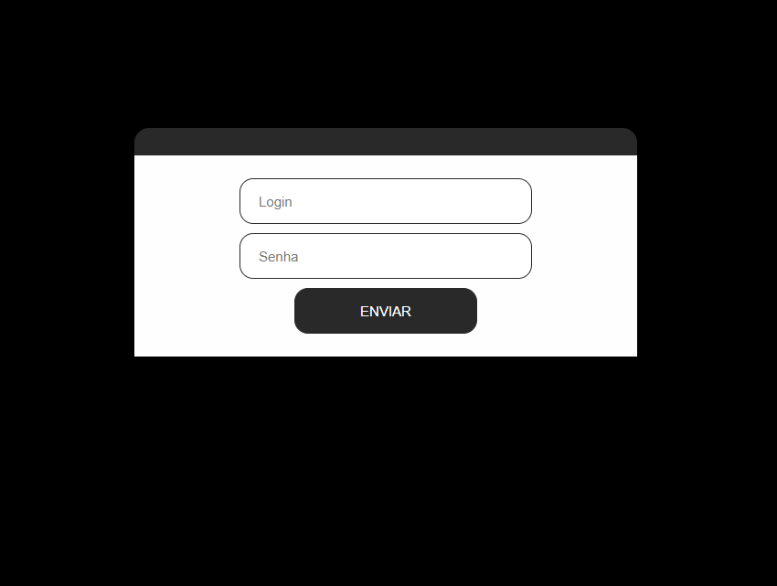
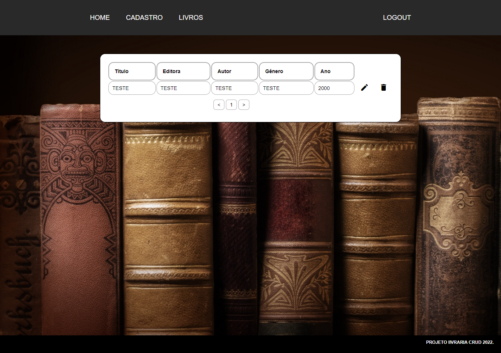
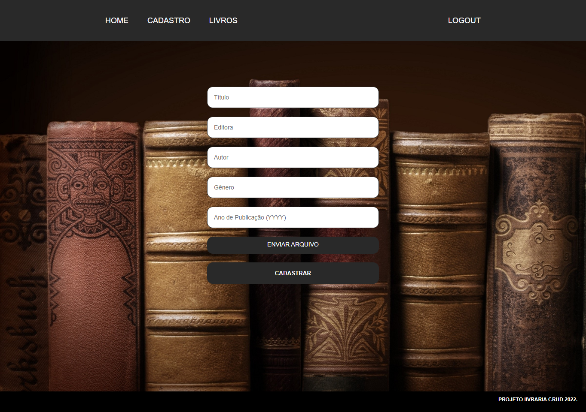
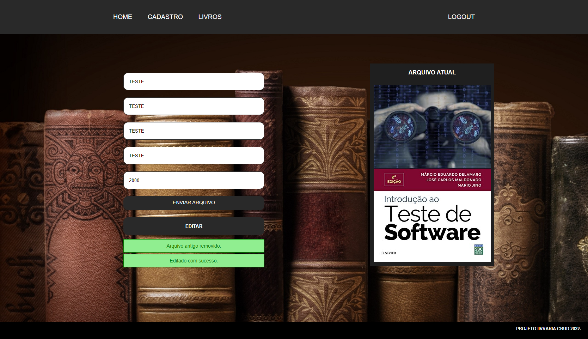

# Projeto CRUD
 

## Resumo

Sistema deselvolvido com php, realizando operações de criação, visualização, edição e exclusão. Tela de login utilizando formulários com login e senha em criptografia md5,
listagem de itens em tabelas com icones de edição e exclusão, upload de arquivos com substituição dos mesmos mantendo integridade.

> Login

> Registros

> Cadastro

> Editar

- Tela de login
- Ação de login utilizando php com criptografia md5 para senha
- Utilização de banco de dados
- Tela de cadastro com formulário
- Tela de edição com value atualizado
- Tela de listagem com tabela
- Icone de exclusão de registro
- Paginação de itens
- Upload de arquivos no cadastro e edição
- Visualização do upload img em edição

## 💻 Tecnologias

- HTML
- CSS
- PHP
- BD
- Git e Github

## 💙 Contato

marcelo_scarvalho@outlook.com